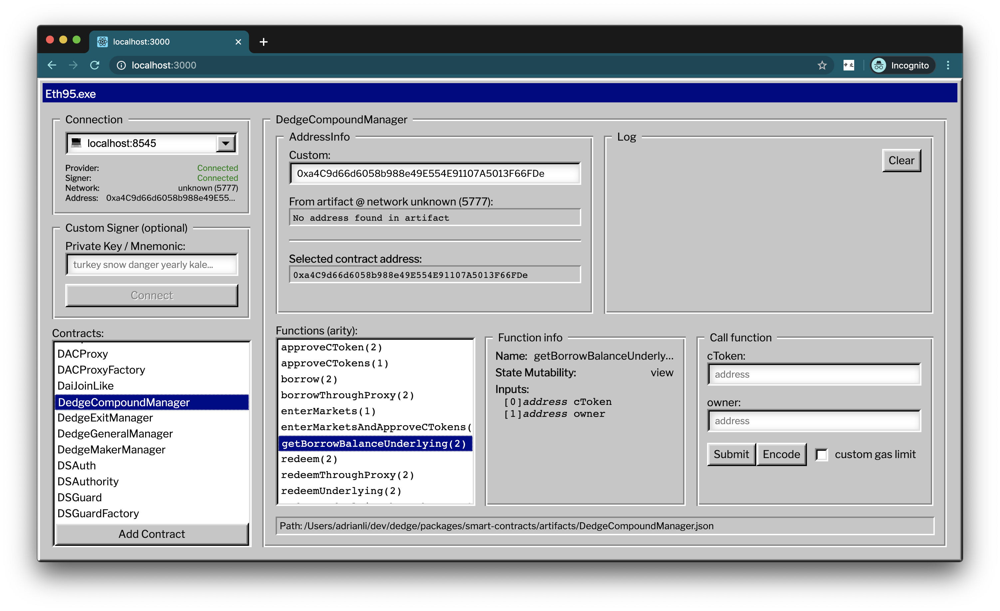

```
███████╗████████╗██╗  ██╗ █████╗ ███████╗
██╔════╝╚══██╔══╝██║  ██║██╔══██╗██╔════╝
█████╗     ██║   ███████║╚██████║███████╗
██╔══╝     ██║   ██╔══██║ ╚═══██║╚════██║
███████╗   ██║   ██║  ██║ █████╔╝███████║
╚══════╝   ╚═╝   ╚═╝  ╚═╝ ╚════╝ ╚══════╝
```                                         

[](https://circleci.com/gh/adrianmcli/eth95)
[](https://www.npmjs.com/package/eth95)


---



_**Instant retro UI for calling any contract function you want**_

See it online @ [eth95.dev](https://eth95.dev/) here's an example with DAI:

```
https://eth95.dev/?network=1&address=0x6b175474e89094c44da98b954eedeac495271d0f
```

[Direct Link](https://eth95.dev/?network=1&address=0x6b175474e89094c44da98b954eedeac495271d0f)

## Features

- 🤙 Call any contract function as long as you have the ABI
- 🔌 Connect via localhost:8545, MetaMask, or a custom node URL
- ⚡ Watches your artifacts folder and automatically updates the UI
- 🔢 Encode your calls for a proxy to call on your behalf
- ⚙️ Set a custom signer or a custom contract address
- 📜 Built-in log for easy visibility

## Install

Works on any dapp project (Truffle, Buidler, etc.) as long as you point it to the JSON artifacts. And even if you don't have a project, you can run it by itself and manually add ABIs and artifacts.

1. Install

    ```shell
    npm install -g eth95
    ```

2. Run with path to your artifacts folder:

    ```shell
    eth95 ./build/contracts
    ```

## How it works

When `eth95` is run, an Express server is fired up and a frontend (packaged by [Parcel](https://parceljs.org/)) is served at `localhost:3000` (you can define the port with a flag `-p 1234`). The server will watch the directory you passed in for any changes to your artifacts and send those changes down to the frontend via Websockets.

Note that you can also add any contracts you want if you have the ABI or Artifact (there is an Add Contract button).

## Contact

If you have any questions or comments, please file an issue.
